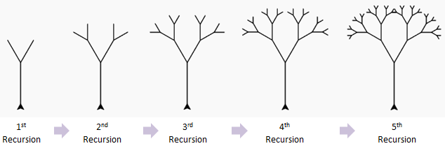

[Back to Unit 1](unit-1.md)  &nbsp;&nbsp;&nbsp;&nbsp; [Forward to Unit 3](unit-3.md)

# Unit 2 -- Recursion



# Overview

- Functional programming (high level)
- Tools for development
  - Scala worksheet
  - `main` function
  - write your own test cases
- `if` returns a value
- recursion
  - string interpolation
  - simple recursion
  - tail recursion
- `Vector[]` vs `List[]` vs `Seq[]`
  - accessing with `head` and `tail`
  - accessing by index
  - accessing with pattern matching
- folding
  - simple and complex cases
  - with function name vs anonymous function
- function, local function, anonymous function

# What is Functional Programming (FP)?

The answer depends on who you ask.  There are several principles:

- Recursion
- Avoiding mutation
- Avoiding side effects
- Pure functions
- Functions as objects
- Higher order functions

There are several current and historical functional programming languages:

- Common Lisp
- Scheme
- ML
- OCaml
- Erlang
- Elixer
- Haskell
- Clojure
- F#
- Scala


# Accessing `Vector[]` and `List[]`

- Constructors: `Vector(1,3,4)`, `List(2,3,5,7,11)`
- Accessing `Vector`:   `v(3)`
- Accessing `List`: `v.head`, `v.tail`
- Pattern matching:
```scala
v match {
  case Nil => ...
  case v::Nil => ...
  case v::vs => ...
}
```

## WARNING: `Array` vs `Vector`

We will not using `Array`.  The `Array` type is a type inherited from
Java and is a mutable data structure.  We will avoid mutable data
structure.  There are some exceptions when we cannot avoid `Array`.
- The argument of `main` must by of type `Array[String]`

```scala
def main(argv:Array[String]):Unit = {
  ...
}
```

- The `String` method named `split`, which Scala inherits directly
  from Java returns a `Array[String]`. However, we can call `toList`
  or `toVector` to convert it to a different immutable type.

```scala
  "ab,cd,ef,xyz".split(",")          // returns an `Array[String]`
  "ab,cd,ef,xyz".split(",").toList   // returns a  `List[String]`
  "ab,cd,ef,xyz".split(",").toVector // returns a  `Vector[String]`
```


# Recursion on `List` and `Vector`


- Introduction to basic concepts in functional programming. 
- A central theme in functional programming is computing results
  without mutating state.
- One common way of achieving this is through a recursive function.

We may implement recursive or iterative function in three principle ways.

- Simple-recursion, 
- Tail-recursion, 
- Reduction using `fold`, `reduce`, and `foldLeft`


# Simple Recursion

A simple recursive function requires stack size proportional to the
length of the `List` or `Array`.  If the data is too large, the stack
will overflow.

Recursion on `Vector` looks very different than recursion on `List`.

```scala
  def sumIntegersBySimpleRecursion(ints: List[Int]): Int = {
    ints match {
      case List() => 0
      // common variable names are also h::t or head::tail  or first::rest
      case i :: is => i + sumIntegersBySimpleRecursion(is)
    }
  }

  def sumIntegersBySimpleRecursion(ints: Vector[Int]): Int = {
    def recur(n:Int): Int = {
      if (n == ints.size)
        0
      else
        ints(n) + recur(n+1)
    }
    recur(0)
  }
```

# Tail Recursion

A tail recursive function requires constant stack size.  The stack
size does not grow with the length of the `List` or `Array`.

```scala
  def sumIntegersByTailRecursion(ints: List[Int]): Int = {
    @scala.annotation.tailrec
    def sumRest(acc: Int, rest: List[Int]): Int = {
      rest match {
        case List() => acc
        case i :: is => sumRest(acc + i, is)
      }
    }

    sumRest(0, ints)
  }

  def sumIntegersByTailRecursion(ints: Vector[Int]): Int = {
    @scala.annotation.tailrec
    def sumRest(acc: Int, n: Int): Int = {
      if (n == ints.size)
        acc
      else
        sumRest(acc + ints(n), n+1)
    }

    sumRest(0, 0)
  }
```

# Using the `fold` function.

The `fold` family of functions hides this syntactical difference,
preserving on the computation but not the recursion pattern itself.

```scala
  def sumIntegersByFold(ints: List[Int]): Int = {
    ints.fold(0)(_ + _)
  }

  def sumIntegersByFold(ints: Vector[Int]): Int = {
    ints.fold(0)(_ + _)
  }
```

How can we write a function to sum a given sequence of integers
whether a `List[]` or a `Vector`?  The `Seq[]` class can be used for
this purpose.  But when using `Seq[]` you must not make any
assumptions about exactly what kind of sequence you have.


```scala
  def sumIntegersByFold(ints: Seq[Int]): Int = {
    ints.fold(0)(_ + _)
  }
```


## Other `fold` examples

- `fold`
- `foldLeft`
- `reduce`


## `fold` the simple case

How to `fold` with binary function vs unary function accepting a 2-tuple.

Suppose 
- `A` is some type
- `f` is a binary function taking two objects of type `A` 
- `seq` is a _collection_ of whose elements are of type `A`, e.g., `List[A]`, `Vector[A]`
- `z` is an object of type `A`, typically the zero but not necessarily.

Then `fold` returns an element of type `A`, even if `seq` has length 0 or 1.

```scala
  seq.fold(0)(f)
```

Now suppose there is no such _zero_, or suppose we know `seq` is not empty.

```scala
  seq.reduce(f)
```

## `foldLeft` with different input vs output type

You cannot use `fold` because the input and output types are different.
You may, however, use `foldLeft`.

Now suppose your input and output types are different.  E.g., suppose
you have a sequence, `List[String]`, and you want to sum the string
lengths.  I.e,. the input type is `String` and output type is `Int`.
So now `f` must be a binary function which takes an `Int` and a `String` and returns an
`Int`.

For example to find the total length of all the strings in an input sequence.

```scala
seq.foldLeft(0)((acc,str) => acc + str.length)
```

Depending on which types are declared (or not declared) in your program,
you may need to add additional type delcarations such as:

```scala
seq.foldLeft(0)((acc:Int,str:String) => acc + str.length)
```

## Folding different types of collections


The `fold` family of functions works on many different collections.   We have
already seen `List[]` and `Vector[]`, but it also works on `String`.

To count the number of vowels in a string:

```scala
def f(acc:Int, c:Char):Int = {
  acc + (if("aeiou".contains(c)) 1 else 0)
}

"hello world".foldLeft(0)(f)
```

You can also do this without declaring `f` as a separate function.


```scala
"hello world".foldLeft(0)((acc,c) => acc + ( if("aeiou".contains(c)) 1 else 0) )
```


## Running average example

We would like to accept a `List[Int]` and return a list of running sums.
I.e., given `List(1,3,-1)`, we wish to return `List(1,4,3)` because 
- 1 = 1
- 4 = 1 + 3
- 3 = 1 + 3 + -1

First we can construct the call to `foldLeft`, and fill in the
function `g` separately.  Later we can combine them and eliminate the
definition of `g`.

```scala
// Warning not yet correct
List(1, 2, 3, 2, -1, 0, -1)
  .foldLeft(List[Int]())(g)
```

The function `g`, must take two arguments, and accumulator `acc` which is the result of the previous
computation, ie. the running list of sums up to now, and `x` the current element of the input sequence.


If the input list is empty, we construct a singleton list containing just `x`.
Otherwise the `head` of the list is the sum up to now; we can add `x` to `a` and
prepend this onto `acc`.

```scala
def g(acc:List[Int], x:Int):List[Int] = {
  acc match {
    case List() => List(x)
    case a::_ => (a+x):: acc
  }
}
```

However, this computes the running sum in reverse order.  Given
`List(1,3,-1)` it returns `List(3,4,1)`.  We must reverse this value
to get `List(1,4,3)`.

```scala
List(1, 2, 3, 2, -1, 0, -1)
  .foldLeft(List[Int]())(g)
  .reverse
```

We can now eliminate `g`, or not, depending on the preference of the programmer.

```scala
List(1, 2, 3, 2, -1, 0, -1)
  .foldLeft(List[Int]()) {
    (acc, x) =>
      acc match {
        case List() => List(x)
        case a :: _ => (a + x) :: acc
      }
  }
  .reverse
```


# Support files

## Lecture files
- `src/main/scala/lecture/Recursion.scala`
 
## Homework files
- `src/main/templates/Recursion.scala`
- `src/test/waiting/RecursionTestSuite.scala`
