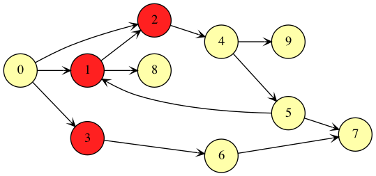

[Back to Unit 2](unit-2.md)  &nbsp;&nbsp;&nbsp;&nbsp; [Forward to Unit 4](unit-4.md)

# Unit 3 -- Graph Theory applications

In this lecture we will review recursive functions and the `fold`
operation by looking some familiar graph algorithms which you already
so in THEG, and which you already implemented in Python.  We'll use
this topic to talk about dealing with types, in particular `Vector`,
`List`, and `Set`.

We will develop functions to compute the so-called *adjacency-list*.
Recall that the adjacency-list, is not necessarily represented by a
`List` type in the programming language, but represents the list of
connections per vertex in a graph.


# Overview


The lecture will cover the following topics:

- Scala worksheet
- Graph theory review: simple graph (simple, undirected, non-weighted, no self-loops)
- Implement a function to compute adjacency-list, given a collection of edges
- Write a `Seq[]` function which accepts `List[]` or `Vector[]`
- Type-parameters for functions
- Pattern matching
- Immutable data structures
  - Tuples: notation `_._1`, `_._2` etc
  - `Map[]` type, 
    - accessing with `m()`, 
    - `m.get(...)`, 
    - `m.getOrElse(...)` and `withDefaultValue`
  - `List[]` type
  - `Set[]` type
  - `String`
  - `Range`
    - `(1 to 12)`
    - `(1 until 12)`
    - `(1 to 12 by 2)`
    - `(12 to 1 by -1)`
- `filter`, `exists`, `contains`, `find`
- Parameterized types
- We will also look at functional graph traversal.
- BFS (breadth-first search)
- `for` comprehension
  - `x <- y`
  - `if`
  - `a = b`
  - `(a,b) <- c`
  - `(a,b) = c`
  - `yield`

# Pattern matching

Various ways to extract components from `Tuple` and `List`.

```scala
// Tuples
val (a,b,c) = (1,2,3)

val t = (1,2,3)

t match {
  case (_,b,c) => println(s"b=$b  c=$c")
}

val b = t._2
val c = t._3

// Lists

val m = List(1,2,3)

m match {
  case Nil => ... // or case List() =>
  case a::Nil => ...
  case a::as => ...
}
```


# Graphs

A Graph is a collection of vertices (nodes) and connections (edges) between them.

Graphs may be directed:


<br>or undirected:


A common way to represent a graph programmatically is with a so called
*adjacency list*, which is not a list at all but rather a particular
data structure.   In Scala we may represent the data structure in many different ways.
If the vertices are integers, we may use a `Vector[Set[Int]]` so that for any integer `n`
`adj(n)` is the set of vertices which connect to vertex `n`.  For example

## Undirected graphs


```scala
// undirected graph
adj = Vector(Set(1,2,3), // neighbors of 0
             Set(0,1),   // neighbors of 1
             Set(0,1,4), // neighbors of 2
             Set(0),     // neighbors of 3
             Set(2))     // neighbors of 4
```

## Directed graphs


```scala
// directed graph
adj = Vector(Set(1,2,3), // neighbors of 0
             Set(1),     // neighbors of 1
             Set(4),     // neighbors of 2
             Set(),      // neighbors of 3
             Set())      // neighbors of 4
```

## Using `Map[]` to represent a graph

We may also represent the adjacency-list as  `Map[Int,Set[Int]]`.

```scala
// undirected graph
adj = Map(0 -> Set(1,2,3), // neighbors of 0
          1 -> Set(0,1),   // neighbors of 1
          2 ->  Set(0,1,4), // neighbors of 2
          3 ->  Set(0),     // neighbors of 3
          4 ->  Set(2))     // neighbors of 4

// directed graph
adj = Map(0 -> Set(1,2,3), // neighbors of 0
          1 -> Set(2),     // neighbors of 1
          2 -> Set(4),     // neighbors of 2
          3 -> Set(),      // neighbors of 3
          4 -> Set())      // neighbors of 4
```

Using the `Map[]` type allows us to completely omit vertices with no neighbor.


```scala
// directed graph
adj = Map(0 -> Set(1,2,3), // neighbors of 0
          1 -> Set(2),     // neighbors of 1
          2 -> Set(4))     // neighbors of 2
```

Using a `Map[]` also allows us to use types other than `Int` as verticies, such as string.

```scala
// directed graph
adj = Map("Jim"   -> Set("Tom", "Alice"),
          "Tom"   -> Set("Alice","Mary"),
          "Alice" -> Set("Tom"))
```


# Breadth First Search BFS

Now we look at a functional apprach to BFS.  We start with an example.
Take this directed graph.


We wish to make a BFS starting from vertex 0.


Which vertices are neighbors of vertex 0.



At step 2, the vertices reachable from 0 are 1, 2, and 3.


The verticies reachable from 1, 2, and 3 are 2, 4, 6, and 8.  However,
2 has already been visited.  So step 3 of the BFS finds 4, 6, and 8.


Finally, at step 4, the vertices reachable from 4, 6, and 8 are 5, 9,
and 7.  Notice that vertex 2 is also reachable from 5 which has
already been reached in a previous step.

So we see that when performing a BFS we need to watch out for vertices
previously visited, and also guard against loops.


# Support files

## Lecture files
- `src/main/scala/lecture/Theg.scala`
 
## Homework files
- `src/main/templates/Theg.scala`
- `src/main/templates/AdjStdLib.scala`
- `src/test/waiting/ThegTestSuite.scala`
- `src/test/waiting/AdjStdLibTestSuite.scala`


<!--  LocalWords:  img programmatically alt png THEG
 -->
