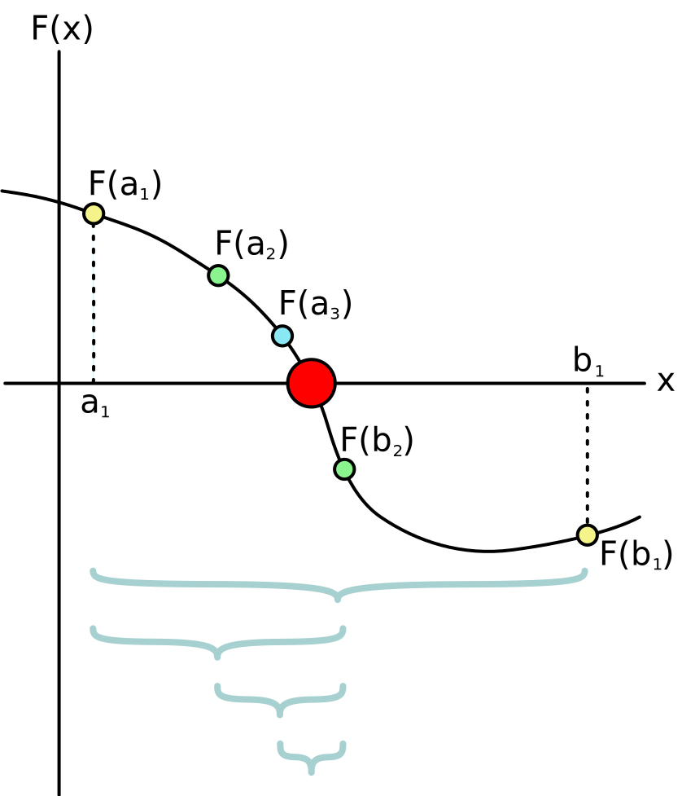

[Back to Unit 3](unit-3.md)  &nbsp;&nbsp;&nbsp;&nbsp; [Forward to Unit 5](unit-5.md)

# Unit 4 -- Higher order functions

# Overview

- Passing functions as parameters
- `Boolean` type
- `Option[]` type
- Partial predicate problem
- Convergence by recursion

# sorting a sequence

- `sorted` -- sort using the default compare function
```scala
List(2,1,3).sorted // returns List(1,2,3)
```
- `sortBy` -- sort by generated value, e.g., 
```scala
List(-2,1,3).sortBy(abs) // returns List(1,-2,3)
```

- `sortWith` -- sort using binary function returning a `Boolean`

```scala
val data = List("hello","Hello","HELLO","world","WORLD","World")

def cmp(str1:String, str2:String):Boolean = {
  if (str1.toLowerCase != str2.toLowerCase)
    str1.toLowerCase < str2.toLowerCase
  else
    str1 < str2
}

data.sortWith(cmp) // returns List("HELLO", "Hello", "hello", "WORLD", "World", "world")
```


# Binary Search


Central to functional programming is the programmatic manipulation of
functions.

In this section we will look at various ways to implement the binary
search function.  This is an example of a function which takes another
function as argument.


# Using binary search to find root of polynomial




```
By Bisection_method.svg: Tokuchanderivative work: Tokuchan (talk) - Bisection_method.svg, CC BY-SA 3.0, https://commons.wikimedia.org/w/index.php?curid=9382140
```


# Support files

## Lecture files
- `src/main/scala/lecture/BinarySearch.scala`

 
## Homework files
- `src/main/templates/BinarySearch.scala`
- `src/test/waiting/BinarySearchTestSuite.scala`


